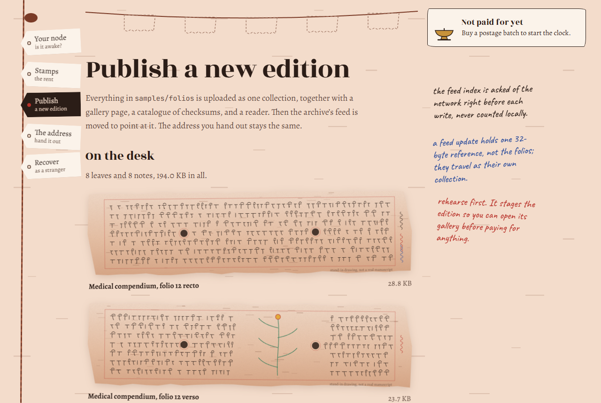
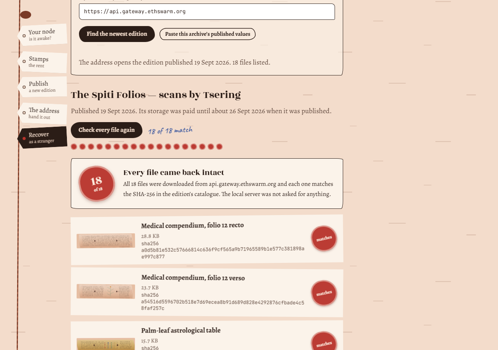
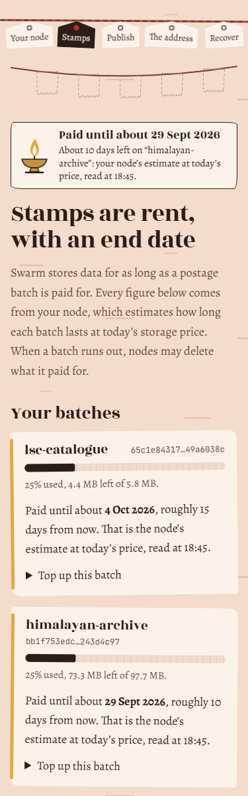

# Eight hundred winters, one lapsed invoice

In a stone vault above the Spiti valley, birch-bark folios have survived eight hundred winters.
Tsering spent two of them photographing eleven thousand pages. The photographs then nearly died
in six years, because the cloud account they lived in stopped being paid for.

This repository puts the scans on [Swarm](https://www.ethswarm.org/) so that **Tsering can hand
someone a single address, delete the app, and that person still gets every folio back** — and
it is honest, everywhere, about how long that storage is actually paid for.

```
            published once, never changes
   ┌──────────────────────────────────────────────┐
   │  archive address  = feed manifest(owner, topic) │
   └───────────────┬──────────────────────────────┘
                   │  newest feed update (index 0, 1, 2 … read from the network)
                   ▼
   edition N  = one collection:  index.html · catalogue.json · recover.html · ABOUT.txt · folios/…
                   ▲                         (SHA-256 of every folio)   (the reader travels with the data)
   edition N-1 …   │  still retrievable while its postage is paid
```

## The published identifiers (where to find them)

Everything a stranger needs is public and lives in two **tracked** files at the repository root,
written by `npm run archive -- publish` (`src/core/record.ts` → `writeArchiveJson`,
`writePublishedMd`) and committed as the hand-over:

| What | `archive.json` field | Also in |
|---|---|---|
| **Archive address** = feed manifest reference (hand this out) | `address.feedManifest` | `PUBLISHED.md`, CLI "ARCHIVE ADDRESS", UI *The address* |
| Feed owner (public address of the feed signer) | `feed.owner` | `PUBLISHED.md` (copyable code block) |
| Feed topic (32 bytes, hex) | `feed.topic` | `PUBLISHED.md` (copyable code block) |
| Postage batch + paid-until estimate | `storage.batchId`, `storage.paidUntil` | `PUBLISHED.md` |

The topic is deterministic — keccak256 of the text `tsering/himalayan-manuscripts/v1`:

```
86cbe92d33d89dc878e0991ed53a92aa27905b4e21fee1a78c64683eab73f415
```

The owner and the archive address only exist once the feed signer has been created and the
first edition published, so they are not invented here: until then `archive.json` and
`PUBLISHED.md` are simply absent, and `status`/the UI say "nothing published yet".

## What you get

| | |
|---|---|
| **`archive` CLI** | check the node, buy/top up postage, publish a new edition behind the feed, read live status |
| **Scriptorium** (web UI) | the same, with a paid-until lamp that is only ever lit by a number from your node |
| **`recover`** | gets every file back from *owner + topic* (or the address) and a Bee endpoint — nothing else |
| **`reader/recover.html`** | one self-contained HTML file doing the same in any browser, even from `file://` |
| **`templates/gallery.html`** | shipped inside every edition, so `/bzz/<address>/` is a browsable archive with checksums |
| **`docs/RECOVERY.md`** | the byte-level recipe, for when every tool here is gone too |

## Before you start

1. Install [Swarm Desktop](https://desktop.ethswarm.org). It bundles Bee and serves its API on `http://localhost:1633`.
2. Redeem your gift code **inside Swarm Desktop** (Info → Setup wallet). It never goes in this repo, a file, a
   screenshot or a chat — the secret scanner here fails the build if a key shows up in a committable file.
3. Wait until Desktop reports **Mode: light**. Ultra-light nodes can only download.
4. Node 22 (`nvm use`), then:

```bash
npm ci
npm run archive -- doctor           # is the node awake, light, funded?
```

## Publish

```bash
npm run archive -- quote --size 100mb --days 7         # what a batch would cost (nothing spent)
npm run archive -- buy   --size 100mb --days 7 --yes   # spends xBZZ; saves the id, then waits until usable

npm run archive -- publish --dry-run                 # stages the edition, reads the feed, spends nothing
npm run preview:edition                              # look at the staged gallery on http://127.0.0.1:4174

npm run archive -- publish                           # upload → read feed index from network → write → read back
npm run archive -- status                            # live paid-until + newest feed index
npm run archive -- verify --gateway                  # can the public gateway serve the address yet?
```

Prices move with the network. In September 2026 the smallest batch (100 MB) cost about
0.09 xBZZ per day and 1 GB about 0.37 xBZZ per day, so a gift-code wallet should start small and
top up later. Always `quote` first.

`publish` writes two **tracked** files: `archive.json` and `PUBLISHED.md`. They hold only public
values — the feed owner *address*, the topic and the archive address. Commit them; they are the
hand-over. The feed's private key stays in `.secrets/feed-key.hex` (gitignored) or the
`FEED_PRIVATE_KEY` variable in `.env` (gitignored). Back it up: without it you can't publish new
editions, though readers are unaffected.

Put your own scans in a folder and pass `--dir path/to/scans` (or set `FOLIOS_DIR`). The sample
folios in `samples/folios` are stand-in drawings, generated by `npm run make:samples`.

### The web UI

```bash
npm run serve        # local API on 127.0.0.1:4173 (talks to Bee; keeps the key in Node)
npm run ui           # dev UI with hot reload on http://localhost:5173
# or: npm run build:web && npm run serve  → everything on http://127.0.0.1:4173
```

Buying, topping up and publishing each need an explicit confirmation, and the server refuses
writes that don't come from its own page.

| Publish: the folios on the desk, then a rehearsal before anything is paid for | Recover as a stranger: owner, topic, gateway, nothing else |
|---|---|
|  |  |



The butter lamp at the top is the paid-until estimate. It is only lit by a batch TTL the node
reported; with no batch, or no node, it stays dark and says why.
<br clear="right">

## Recover — as a stranger

```bash
npm run recover -- <owner> <topic> --out recovered                     # default: public gateway
npm run recover -- --manifest <archive address> --bee http://localhost:1633
```

It downloads every file listed in the edition's own `catalogue.json` (cross-checked against the
edition's manifest), verifies each SHA-256, and writes `RECOVERY-REPORT.json`. Its source,
`src/recover/`, is not allowed to import anything from the publisher — a test and an ESLint rule
enforce that.

No Node? Open `reader/recover.html` in a browser, or `https://api.gateway.ethswarm.org/bzz/<address>/`.

## How long is it paid for?

Swarm storage is prepaid rent: a postage batch drains every block, and when it is empty nodes may
drop what it paid for — **including the feed updates, so the address goes quiet too**. Every
"paid until" in this project is the node's own batch TTL (`bee.stamp.get(id).duration`), shown
with the time it was read; when the node doesn't answer the tool says *unknown* rather than
guessing. Anyone can top up the batch whose ID is in `archive.json`. More in
[`docs/STORAGE-HONESTY.md`](docs/STORAGE-HONESTY.md).

## How each check is met

| # | Check | Where in the code |
|---|---|---|
| 1 | Content published behind a feed; the address shown is the feed's | `src/core/feed.ts:127` `ensureFeedManifest` → `bee.feed.createManifest(batchId, topic, owner)`; `src/core/publish.ts:164` returns it as `archiveAddress`; CLI prints it as "ARCHIVE ADDRESS" (`src/cli/index.ts:150`); UI *The address* (`web/src/pages/AddressPage.tsx`). The edition's collection reference is only ever labelled a snapshot |
| 2 | Feed owner and topic in a tracked, copyable file | `archive.json` (`feed.owner`, `feed.topic`, `address.feedManifest`) and `PUBLISHED.md` (owner and topic each in their own code block), written by `src/core/record.ts:60` `writeArchiveJson` and `:90` `writePublishedMd` from `publish.ts:237`. See [The published identifiers](#the-published-identifiers-where-to-find-them) |
| 3 | Next feed index read from the network before every update | `src/core/feed.ts:145` `publishToFeed`: `resolveNextIndex` (`:104`, `bee.feed.fetchLatestUpdate` → `feedIndexNext`; on a 404, chunk probing; then the target slot is re-read and stepped past if already taken, `:118`) runs immediately before `writer.uploadReference(batchId, collectionReference, { index: next })` (`:156`). 5xx is retried with back-off, then aborts. No literal, no counter, nothing read from `archive.json` or `.state/`. Tests: `test/feed-index.test.ts` (read-then-write order, 500 ≠ empty feed, false 404 → N+1, occupied slot stepped past). ESLint bans literal indexes in `src/` |
| 4 | Content larger than a chunk uploaded separately; the feed gets only its reference | `src/core/collection.ts:43` `uploadCollection` → `bee.collection.upload` (whole edition folder); `publish.ts:200`→`:208` passes `uploaded.reference` to `publishToFeed`, which calls `uploadReference`. `uploadPayload` is banned by ESLint (`eslint.config.js`) and `test/guarantees.test.ts` |
| 5 | Recovery from published identifiers only | `src/recover/main.ts` (`npm run recover -- <owner> <topic>` or `--manifest <ref>`, plus `--bee`) → `src/recover/recover.ts:145` `recover`. Reads no `.env`, `archive.json`, key or local index; the folio list comes from the edition's own `catalogue.json` and manifest. Import isolation enforced by `eslint.config.js` and `test/guarantees.test.ts`. Browser version: `reader/recover.html` |
| 6 | Batch remaining lifetime read from the node and surfaced | `src/core/stamps.ts:41` `describeBatch` → `bee.stamp.get(id)`; `summarise` (`:21`) uses the node's `duration` (batchTTL) → `src/core/ttl.ts` `termFromTtlSeconds`/`honestSentence`. Shown by CLI `status`/`stamps`/`publish`, the UI lamp, and written to `archive.json.storage`, `PUBLISHED.md` and each edition's `catalogue.json` (`publish.ts:225` re-reads it live before writing). Unknown → says "unknown", never a constant |
| 7 | Reading a feed with no updates has defined first-run behaviour | `src/core/feed.ts:104` `resolveNextIndex`, first-run guard at `:111`: HTTP 404 → index 0, `firstRun: true`, but only if update #0 is absent when read directly as a chunk (`:113`). Bee 2.8 also answers 404 when the lookup fails, so if #0 exists the real head is found by probing chunks (`src/shared/feed-probe.ts`). Any other error is retried, then aborts rather than guessing. `readFeedHead` (`:181`) → `{ empty: true }` under the same guard. `src/recover/recover.ts:113` `findFeedHead` (same check, #0 read with retries) → status `empty-feed` (`:201`), exit code 2. `reader/swarm-lite.js:258` `findLatestIndex` never uses the lookup; #0 absent after retries → `-1n` → "no updates yet" |
| 8 | No secrets in tracked files | Feed key only in gitignored `.secrets/feed-key.hex` or `.env` (`src/core/signer.ts`); `.env.example` has an empty key; test keys are generated with `randomBytes` at runtime; `scripts/check-secrets.ts` (`npm run check:secrets`) scans every committable file and runs in `npm run check`. Bought batch ids are saved to the gitignored `.state/last-batch.txt` (`src/core/local-state.ts`) before waiting for them to become usable (`src/core/stamps.ts:76` `buyBatch` → `:116` `waitUntilUsable`) |

## Checks

```bash
npm run check        # prettier --check · eslint · tsc (cli, web, tests) · vitest · build · secret scan
```

The tests cross-check the zero-dependency reader's keccak256, feed identifiers and SOC parsing
against bee-js, prove the feed index is read from the network immediately before every write
(and that a 500 is never mistaken for an empty feed), and guard the recovery module's isolation.

## Notes and limits

- bee-js is pinned to **13.1.0** (the v13 namespaced API: `bee.feed.makeWriter`, `bee.stamp.get`,
  `bee.storage.buy`, …). Tested against Bee 2.8.2 / API 8.1.1 from Swarm Desktop.
- `bee.collection.uploadFromDirectory` in 13.1.0 builds manifest paths with backslashes on
  Windows, so this tool builds the collection list itself with `/` paths.
- bee-js' own "next index" lookup treats *any* HTTP error as an empty feed. This tool never lets it
  choose: it reads the index and passes it explicitly.
- The public gateway refuses Swarm's custom request headers from browsers and sometimes answers
  500 for a missing chunk; the browser reader uses plain GETs and retries.
- New editions can take a few minutes to become visible through the public gateway.
- One feed key, one publisher. If the key is lost, the address can't move to a new edition; the
  existing editions stay readable while paid for.

MIT licensed.
