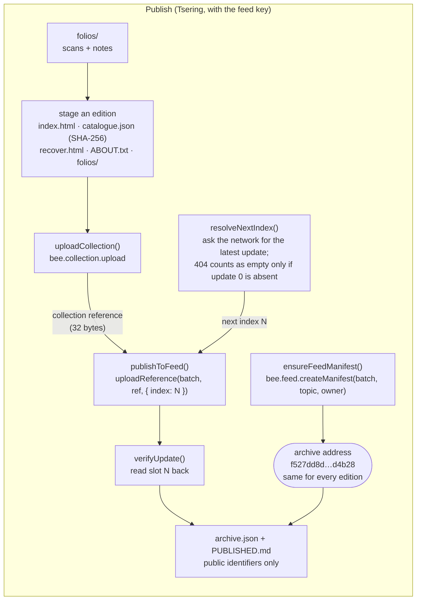
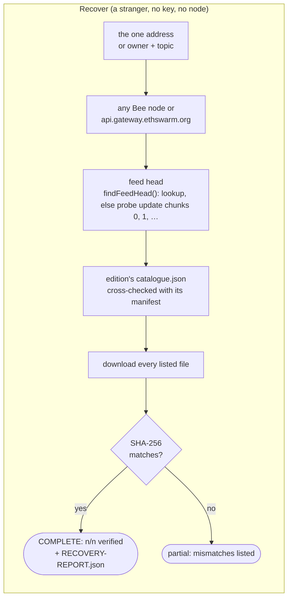
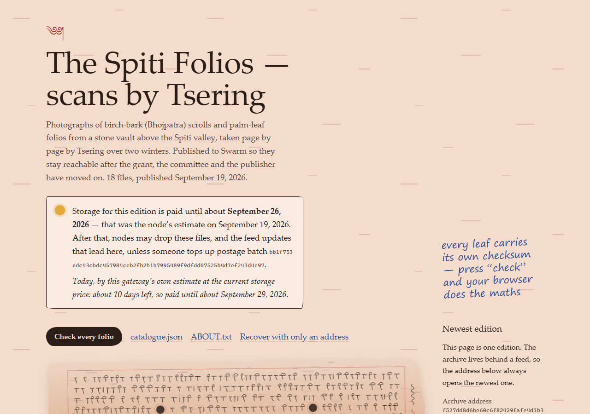
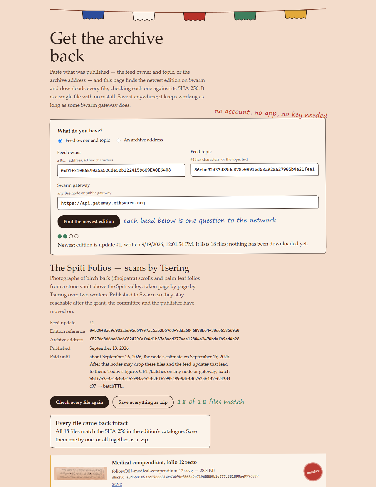

<p align="center">
  
</p>

<p align="center">
  <a href="https://www.npmjs.com/package/@ethersphere/bee-js/v/13.1.0"></a>
  <a href=".nvmrc"></a>
  <a href="tsconfig.base.json"></a>
  <a href="test/"></a>
  <a href="LICENSE"></a>
  <a href="https://api.gateway.ethswarm.org/bzz/f527dd8d6be60c6f82429fafe4d1b37e8acd277aaa12844a2474bdafb9ed4b28/catalogue.json"></a>
  <br>
  <a href="https://github.com/Tan0610/p1-archive/actions/workflows/ci.yml"></a>
  <a href="https://github.com/Tan0610/p1-archive/actions/workflows/storage-watchdog.yml"></a>
</p>

In a stone vault above the Spiti valley, birch-bark folios have survived eight hundred winters.
Tsering spent two of them photographing eleven thousand pages. The photographs nearly died within
six years, because the cloud account they lived in stopped being paid for.

This repository puts the scans on [Swarm](https://www.ethswarm.org/) so that **Tsering can hand
someone a single address, delete the app, and that person still gets every folio back**. It is
also honest, everywhere, about how long that storage is actually paid for.

**Contents:** [60-second tour](#60-second-tour) ·
[What the judge checks](#what-the-judge-checks) · [Verify without us](#verify-without-us) ·
[How it works](#how-it-works) · [Screenshots](#screenshots) · [Quick start](#quick-start) ·
[Published identifiers](#the-published-identifiers) · [Recover as a stranger](#recover-as-a-stranger) ·
[How long is it paid for?](#how-long-is-it-paid-for) · [Line-level detail](#how-each-check-is-met-line-by-line) ·
[Notes and limits](#notes-and-limits)

## 60-second tour

A CLI (plus a small web UI) that publishes a manuscript archive to Swarm behind a feed. There is
**one address that never changes** while the contents do, and a stranger can get every file back
from that address alone. Everything below was **done live on Swarm mainnet on 19 Sept 2026**
(full log: [`docs/LIVE_EVIDENCE.md`](docs/LIVE_EVIDENCE.md)).

| | |
|---|---|
| 🏔️ **One address** | `f527dd8d6be60c6f82429fafe4d1b37e8acd277aaa12844a2474bdafb9ed4b28` (the feed manifest), printed unchanged by both publishes |
| **Two editions** | feed index **0** (16 folio files) and index **1** (18: one new leaf, one corrected note). Each index was read from the network just before the write |
| **A stranger's recovery** | fresh clone, no keys, no node: **18/18 files, SHA-256 verified** from the public gateway; `--all-editions` lists #0 and #1 |
| **Honest storage** | paid-until is the node's batch TTL (≈ 7 days at publish), never a constant. Topped up with the CLI's `extend` the same day (+3 days, 0.2822 xBZZ): **paid until about 29 Sept 2026** |
| **Someone gets warned** | a daily keyless GitHub Actions watchdog opens a top-up issue when 3 days or fewer are left (tested: it opened issue #1, then closed it) |

## What the judge checks

The eight official test cases, where each is met, and what happened on the live network. Links go
to the exact function.

| # | Test case (pts) | Where it is met | Live evidence |
|---|---|---|---|
| 1 | **Content is published behind a feed, not only as a bare upload reference** (8) | [`feed.ts` → `ensureFeedManifest`](src/core/feed.ts#L127) (`bee.feed.createManifest`), [`feed.ts` → `publishToFeed`](src/core/feed.ts#L145), [`publish.ts` → `publish`](src/core/publish.ts#L54) returns the manifest as `archiveAddress`. The collection reference is only ever labelled a snapshot | Address `f527dd8d…d4b28` is the feed manifest for owner + topic. The [catalogue on the public gateway](https://api.gateway.ethswarm.org/bzz/f527dd8d6be60c6f82429fafe4d1b37e8acd277aaa12844a2474bdafb9ed4b28/catalogue.json) resolves through the feed to edition 2 |
| 2 | **The feed's owner address and topic are recorded in a tracked file** (6) | [`archive.json`](archive.json) (`feed.owner`, `feed.topic`, `address.feedManifest`) and [`PUBLISHED.md`](PUBLISHED.md), written by [`record.ts` → `writeArchiveJson`](src/core/record.ts#L60) and [`writePublishedMd`](src/core/record.ts#L90) | Owner `0xD1f310B6E40a5a52Cde5Db122415b609EA0E6408`, topic `86cbe92d…f415` = keccak256(`tsering/himalayan-manuscripts/v1`), both committed |
| 3 | **The next feed index is resolved from the network before each update** (16) | [`feed.ts` → `resolveNextIndex`](src/core/feed.ts#L104), called inside [`publishToFeed`](src/core/feed.ts#L145) right before `uploadReference(…, { index: next })` ([L156](src/core/feed.ts#L156)). No literal, no counter, nothing read from `archive.json`. Guarded by [`test/feed-index.test.ts`](test/feed-index.test.ts) and an ESLint rule | Edition 1 was written at index **0**, edition 2 at index **1**, each read from the network first ([Editions table](docs/LIVE_EVIDENCE.md#editions)) |
| 4 | **Content that exceeds one chunk is written to the feed by reference** (12) | [`collection.ts` → `uploadCollection`](src/core/collection.ts#L43) uploads the whole edition; [`publish.ts`](src/core/publish.ts#L208) passes only `uploaded.reference` to `publishToFeed`, which calls `uploadReference`. `uploadPayload` is banned ([`eslint.config.js`](eslint.config.js), [`test/guarantees.test.ts`](test/guarantees.test.ts)) | Edition 2 is 22 files, 220 134 bytes (collection `0fb29f8a…69a0`); the feed update holds its 32-byte reference |
| 5 | **A recovery path reads the archive from the published identifiers alone** (14) | [`recover.ts` → `recover`](src/recover/recover.ts#L145) and [`findFeedHead`](src/recover/recover.ts#L113), run by `npm run recover`; no imports from the publisher (ESLint + test). Browser twin: [`reader/recover.html`](reader/recover.html) | Fresh clone, no `.env`, no key, no node: **COMPLETE: 18/18 files verified by SHA-256**. `reader/recover.html` from disk: **18 of 18 files match** ([screenshot](#screenshots)) |
| 6 | **The batch's remaining lifetime is read from the node** (8) | [`stamps.ts` → `describeBatch`](src/core/stamps.ts#L41) (`bee.stamp.get(id).duration`) → [`ttl.ts` → `honestSentence`](src/core/ttl.ts#L76); shown by CLI, UI lamp, `archive.json`, `PUBLISHED.md`, each edition's catalogue. Keyless mirror: [`scripts/watchdog.ts`](scripts/watchdog.ts) | Node TTL 601 604 s at publish; after the top-up 834 681 s ≈ 9.7 days, agreed by gateway and PostageStamp contract within an hour |
| 7 | **Reading a feed with no updates yet is handled** (8) | [`resolveNextIndex`](src/core/feed.ts#L104): 404 → index 0 **only if** update #0 is truly absent ([L113](src/core/feed.ts#L113)), else probe; [`readFeedHead`](src/core/feed.ts#L181) → `{ empty: true }`; [`findFeedHead`](src/recover/recover.ts#L113) → status `empty-feed`, exit 2; [`swarm-lite.js` → `findLatestIndex`](reader/swarm-lite.js#L258) → "no updates yet" | Edition 1 was written at index 0, which only the empty-feed path can produce (every other path yields 1 or more). Tests cover a truly empty feed, a false 404 and a 500 ([`feed-index`](test/feed-index.test.ts), [`recover-head`](test/recover-head.test.ts), [`swarm-lite`](test/swarm-lite.test.ts)) |
| 8 | **No credential, private key, mnemonic, gift code or authenticated URL appears in any tracked file** (8) | Feed key only in gitignored `.secrets/feed-key.hex` or `.env` ([`signer.ts`](src/core/signer.ts)); [`.env.example`](.env.example) has an empty key; test keys come from `randomBytes`; [`scripts/check-secrets.ts`](scripts/check-secrets.ts) scans every committable file inside `npm run check` | `npm run check:secrets` passes locally and in [CI](.github/workflows/ci.yml) on every push. The gift code was redeemed by the user inside Swarm Desktop and was never written to the repo |

### The brief's "What to do", point by point

Each item is quoted verbatim from the brief.

| The brief says | How and where it is shown |
|---|---|
| "Confirm your node is up and funded: curl localhost:1633 should answer, and Swarm Desktop should report the node in light mode. Ultra-light means the gift code has not landed yet and nothing you upload will work." | `npm run archive -- doctor` ([`bee.ts` → `doctor`](src/core/bee.ts#L45)) checks health, mode and funds, and says plainly when a node is ultra-light. Live: "Bee 2.8.2-7e703f49 is up, mode: light" ([publish log](docs/LIVE_EVIDENCE.md#editions)); the [node screen](#screenshots) shows the same |
| "Buy a postage batch and put a small collection of files on Swarm. Any files stand in for the folios; a handful of images and text is plenty." | `quote`, then `buy` ([`stamps.ts` → `buyBatch`](src/core/stamps.ts#L76)); batch `bb1f753e…4c97` (depth 19). Each edition is one collection ([`uploadCollection`](src/core/collection.ts#L43)): stand-in folio drawings (SVG) with text notes, 16 files in edition 1 and 18 in edition 2 |
| "Give the collection an address that stays the same when the contents change." | The feed manifest ([`ensureFeedManifest`](src/core/feed.ts#L127)) `f527dd8d…d4b28` served edition 1, then edition 2 ([evidence](docs/LIVE_EVIDENCE.md#the-address-that-did-not-change)) |
| "Make it possible for a stranger to recover the whole collection later, knowing only what you chose to publish about it, not what your app happens to have stored on disk." | Published: [`archive.json`](archive.json) and [`PUBLISHED.md`](PUBLISHED.md) (address, owner, topic). Recovery: `npm run recover`, [`reader/recover.html`](reader/recover.html) and [`docs/RECOVERY.md`](docs/RECOVERY.md); `src/recover/` imports nothing from the publisher and reads no local state. Live: a fresh clone with no keys and no node got 18/18 files by SHA-256 |
| "Be honest in the interface about how long the data is actually paid for." | Every paid-until is the node's batch TTL with the time it was read, or "unknown" ([`describeBatch`](src/core/stamps.ts#L41) → [`honestSentence`](src/core/ttl.ts#L76)): CLI, the UI lamp, `PUBLISHED.md` and each edition's gallery. The [watchdog](#the-watchdog-someone-gets-told-before-the-rent-runs-out) opens an issue at 3 days or fewer; a top-up was done live on 19 Sept ([evidence](docs/LIVE_EVIDENCE.md#storage-extended-19-sept-2026)) |
| "Don't paste your gift code into the repo. It belongs in Swarm Desktop and nowhere else." | The gift code was redeemed by the user inside Swarm Desktop only. [`scripts/check-secrets.ts`](scripts/check-secrets.ts) scans every committable file in `npm run check` and in CI; the UI and this README say the same |
| **Deliverable:** "A GitHub repo containing your publishing tool and whatever a stranger needs to read the archive without it." | This repo: the publishing tool (`src/core`, `src/cli`, `web/`) and, kept separate from it, `src/recover/`, `reader/recover.html`, `docs/RECOVERY.md` and the published identifiers |
| **Acceptance:** "Tsering can hand someone a single address, delete the app, and that person still gets every folio back" | A fresh clone with no keys, no node and no local state recovered 18/18 files by SHA-256 from the public gateway, using only owner + topic. The one address alone (`--manifest f527dd8d…`) gives the same 18/18. Nothing from the publisher is imported by `src/recover/` |

## Verify without us

No keys, no node, no account. Everything reads public endpoints.

```bash
npm ci
# 1. every folio back from owner + topic, checked by SHA-256, both editions listed
npm run recover -- 0xD1f310B6E40a5a52Cde5Db122415b609EA0E6408 86cbe92d33d89dc878e0991ed53a92aa27905b4e21fee1a78c64683eab73f415 --all-editions

# 2. the same archive through the one address, with nothing but curl
curl -s https://api.gateway.ethswarm.org/bzz/f527dd8d6be60c6f82429fafe4d1b37e8acd277aaa12844a2474bdafb9ed4b28/catalogue.json

# 3. remaining storage time, address and feed head, from the gateway and Gnosis Chain
npm run watchdog
```

No Node? Open [`reader/recover.html`](reader/recover.html) straight from disk, paste the owner and
topic (or the address), and press *Download and check every file*.

## How it works





Older editions stay retrievable by their snapshot reference while their postage is paid;
`--all-editions` walks the feed and lists them.

## Screenshots

| | |
|---|---|
|  |  |
| **The archive itself**, opened at `/bzz/f527dd8d…/` on a local Bee node. The gallery ships inside every edition and asks the node for today's TTL: "about 10 days left, so paid until about September 29, 2026" | **A stranger's recovery in the browser.** `reader/recover.html` opened from disk, owner + topic, public gateway: newest edition is update #1, **18 of 18 files match** |
|  |  |
| **The address to hand out**, with a QR code, owner and topic, and the recover command. The lamp is lit only by the node's TTL | **Your node**: Bee 2.8.2 in light mode, read live. The margin note is the rule: the gift code lives in Swarm Desktop, never in the repo |
|  |  |
| **Publish**: the folios on the desk, then a dry run before anything is paid for (captured before the first batch was bought, so the lamp is unlit) | **Recover as a stranger** in the web UI: the one address and the public gateway. Each file gets a seal as its SHA-256 checks out: **18 of 18 intact** |


**Stamps at phone width.** Every "paid until" is the node's own estimate, with the time it was
read. The node in this screenshot holds two batches: `himalayan-archive` is this archive's
(`bb1f753e…4c97`); `lsc-catalogue` belongs to another project on the same node.

The screenshots of the gallery, node and stamps screens were captured on 19 Sept 2026, and the
reader, address and recover screens on 20 Sept 2026, all with read-only requests against the live
node and public gateway.
<br clear="right">

## Quick start

1. Install [Swarm Desktop](https://desktop.ethswarm.org). It bundles Bee and serves its API on `http://localhost:1633`.
2. Redeem your gift code **inside Swarm Desktop** (Info → Setup wallet). It never goes in this repo, a file, a
   screenshot or a chat. The secret scanner fails the build if a key shows up in a committable file.
3. Wait until Desktop reports **Mode: light**. Ultra-light nodes can only download.
4. Node 22 (`nvm use`), then:

```bash
npm ci
npm run archive -- doctor                              # is the node awake, light, funded?

npm run archive -- quote --size 100mb --days 7         # what a batch would cost (nothing spent)
npm run archive -- buy   --size 100mb --days 7 --yes   # spends xBZZ; saves the id, then waits until usable

npm run archive -- publish --dry-run                   # stages the edition, reads the feed, spends nothing
npm run preview:edition                                # look at the staged gallery on http://127.0.0.1:4174

npm run archive -- publish                             # upload → read feed index from network → write → read back
npm run archive -- status                              # live paid-until + newest feed index
npm run archive -- verify --gateway                    # can the public gateway serve the address yet?
```

Prices move with the network. In September 2026 the smallest batch (100 MB) cost about 0.09 xBZZ
per day and 1 GB about 0.37 xBZZ per day, so a gift-code wallet should start small and top up
later. Always `quote` first.

<details>
<summary><b>More on publishing, the key, your own scans and the web UI</b></summary>

`publish` writes two **tracked** files: `archive.json` and `PUBLISHED.md`. They hold only public
values: the feed owner *address*, the topic and the archive address. Commit them; they are the
hand-over. The feed's private key stays in `.secrets/feed-key.hex` (gitignored) or the
`FEED_PRIVATE_KEY` variable in `.env` (gitignored). Back it up: without it you can't publish new
editions, though readers are unaffected.

Put your own scans in a folder and pass `--dir path/to/scans` (or set `FOLIOS_DIR`). The sample
folios in `samples/folios` are stand-in drawings, generated by `npm run make:samples`.

```bash
npm run serve        # local API on 127.0.0.1:4173 (talks to Bee; keeps the key in Node)
npm run ui           # dev UI with hot reload on http://localhost:5173
# or: npm run build:web && npm run serve  → everything on http://127.0.0.1:4173
```

Buying, topping up and publishing each need an explicit confirmation, and the server refuses
writes that don't come from its own page.

</details>

### What you get

| | |
|---|---|
| **`archive` CLI** | check the node, buy/top up postage, publish a new edition behind the feed, read live status |
| **Scriptorium** (web UI) | the same, with a paid-until lamp that is only ever lit by a number from your node |
| **`recover`** | gets every file back from *owner + topic* (or the address) and a Bee endpoint, nothing else |
| **`reader/recover.html`** | one self-contained HTML file doing the same in any browser, even from `file://`; it only fetches data, so it works against the public gateway |
| **`templates/gallery.html`** | shipped inside every edition, so `/bzz/<address>/` on a Bee node (e.g. Swarm Desktop) is a browsable archive with checksums |
| **`scripts/watchdog.ts`** | keyless check of remaining storage time, the address and the feed; runs daily on GitHub Actions |
| **`docs/RECOVERY.md`** | the byte-level recipe, for when every tool here is gone too |

## The published identifiers

Everything a stranger needs is public and lives in two **tracked** files at the repository root,
written by `npm run archive -- publish` ([`writeArchiveJson`](src/core/record.ts#L60),
[`writePublishedMd`](src/core/record.ts#L90)) and committed as the hand-over:

| What | `archive.json` field | Also in |
|---|---|---|
| **Archive address** = feed manifest reference (hand this out) | `address.feedManifest` | `PUBLISHED.md`, CLI "ARCHIVE ADDRESS", UI *The address* |
| Feed owner (public address of the feed signer) | `feed.owner` | `PUBLISHED.md` (copyable code block) |
| Feed topic (32 bytes, hex) | `feed.topic` | `PUBLISHED.md` (copyable code block) |
| Postage batch + paid-until estimate | `storage.batchId`, `storage.paidUntil` | `PUBLISHED.md` |

The topic is deterministic: keccak256 of the text `tsering/himalayan-manuscripts/v1`:

```
86cbe92d33d89dc878e0991ed53a92aa27905b4e21fee1a78c64683eab73f415
```

The owner and the archive address only exist once the feed signer has been created and the first
edition published, so they are never invented: before that, `archive.json` and `PUBLISHED.md` are
simply absent, and `status`/the UI say "nothing published yet".

## Recover as a stranger

```bash
npm run recover -- <owner> <topic> --out recovered                     # default: public gateway
npm run recover -- --manifest <archive address> --bee http://localhost:1633
```

It downloads every file listed in the edition's own `catalogue.json` (cross-checked against the
edition's manifest), verifies each SHA-256, and writes `RECOVERY-REPORT.json`. Its source,
`src/recover/`, is not allowed to import anything from the publisher; a test and an ESLint rule
enforce that.

This CLI is the canonical route. No Node? Open `reader/recover.html` in a browser, straight from
disk or any static host, and give it the address or owner + topic: it only fetches data, so it
works against the public gateway. The web UI's *Recover* screen does the same.

**What the public gateway serves:** the data. `catalogue.json` and every folio download from any
gateway, `https://api.gateway.ethswarm.org` included. The HTML pages inside each edition (the
gallery and its `recover.html`) open from your own Bee node, e.g. Swarm Desktop at
`http://localhost:1633/bzz/<address>/`; the public gateway redirects HTML for hashes it has not
approved to an approval form.

## How long is it paid for?

Swarm storage is prepaid rent: a postage batch drains every block, and when it is empty nodes may
drop what it paid for, **including the feed updates, so the address goes quiet too**. Every "paid
until" in this project is the node's own batch TTL (`bee.stamp.get(id).duration`), shown with the
time it was read; when the node doesn't answer, the tool says *unknown* rather than guessing.
Strangers get the same figure without this code: each edition's gallery asks the node serving it
(`GET /batches` → `batchTTL`) and prints today's estimate next to the publish-time snapshot.
Anyone can top up the batch whose ID is in `archive.json`. More in
[`docs/STORAGE-HONESTY.md`](docs/STORAGE-HONESTY.md).

### The watchdog: someone gets told before the rent runs out

```bash
npm run watchdog                                        # ids from archive.json
npm run watchdog -- --batch <id> [--address <ref>] [--gateway URL] [--warn-days 3] [--critical-days 1]
```

`.github/workflows/storage-watchdog.yml` runs it every day, and on demand. It uses only the
tracked `archive.json` and the built-in `GITHUB_TOKEN`; there are no secrets. On warn or critical
it opens (or updates) one issue, *"Archive storage runs out in N days — top it up"*, with both
ways to pay, and closes it when the checks pass again.

<details>
<summary><b>What the watchdog reads, exit codes, and the two ways to top up</b></summary>

`scripts/watchdog.ts` needs no key and no node. It reads the batch's remaining TTL from the public
gateway's `GET /batches` (the gateway has no per-batch read; the full list is about 80 KB) and
cross-checks it against the PostageStamp contract on Gnosis Chain (`remainingBalance ÷ lastPrice`
× 5 s blocks), which is also the fallback if the gateway is down. It then checks that
`/bzz/<address>/catalogue.json` still answers and lists folios, and probes the feed's update chunks
for the newest index. Exit code 0 ok, 1 warn (3 days or fewer left, or the TTL couldn't be read), 2
critical (1 day or fewer, expired, or the address or feed no longer resolves). The pure parts are
tested in `test/watchdog.test.ts`, including the contract function selectors.

The workflow's token has `issues: write` and `contents: read`. The issue offers:

- whoever runs the node: `npm run archive -- extend --batch <id> --days 30 --yes`;
- anyone else, with no node and no permission: `PostageStamp.topUp(batchId, amountPerChunk)` on
  Gnosis Chain (`0x45a1502382541Cd610CC9068e88727426b696293`, paid in xBZZ
  `0xdBF3Ea6F5beE45c02255B2c26a16F300502F68da`). The contract has no owner check. The issue has a
  ready `cast` recipe and today's cost.

A critical result also fails the run, so GitHub's failed-workflow notification goes out as well.
`.github/workflows/ci.yml` runs `npm run check` on every push.

</details>

## How each check is met, line by line

<details>
<summary><b>Open the line-level table</b> (every reference checked against the current source)</summary>

| # | Check | Where in the code |
|---|---|---|
| 1 | Content published behind a feed; the address shown is the feed's | [`src/core/feed.ts:127`](src/core/feed.ts#L127) `ensureFeedManifest` → `bee.feed.createManifest(batchId, topic, owner)`; [`src/core/publish.ts:164`](src/core/publish.ts#L164) returns it as `archiveAddress`; CLI prints it as "ARCHIVE ADDRESS" ([`src/cli/index.ts:153`](src/cli/index.ts#L153)); UI *The address* ([`web/src/pages/AddressPage.tsx`](web/src/pages/AddressPage.tsx)). The edition's collection reference is only ever labelled a snapshot |
| 2 | Feed owner and topic in a tracked, copyable file | `archive.json` (`feed.owner`, `feed.topic`, `address.feedManifest`) and `PUBLISHED.md` (owner and topic each in their own code block), written by [`src/core/record.ts:60`](src/core/record.ts#L60) `writeArchiveJson` and [`:90`](src/core/record.ts#L90) `writePublishedMd` from [`publish.ts:237`](src/core/publish.ts#L237). See [The published identifiers](#the-published-identifiers) |
| 3 | Next feed index read from the network before every update | [`src/core/feed.ts:145`](src/core/feed.ts#L145) `publishToFeed`: `resolveNextIndex` ([`:104`](src/core/feed.ts#L104), `bee.feed.fetchLatestUpdate` → `feedIndexNext`; on a 404, chunk probing; then the target slot is re-read and stepped past if already taken, [`:118`](src/core/feed.ts#L118)) runs immediately before `writer.uploadReference(batchId, collectionReference, { index: next })` ([`:156`](src/core/feed.ts#L156)). 5xx is retried with back-off, then aborts. No literal, no counter, nothing read from `archive.json` or `.state/`. Tests: `test/feed-index.test.ts` (read-then-write order, 500 ≠ empty feed, false 404 → N+1, occupied slot stepped past). ESLint bans literal indexes in `src/` |
| 4 | Content larger than a chunk uploaded separately; the feed gets only its reference | [`src/core/collection.ts:43`](src/core/collection.ts#L43) `uploadCollection` → `bee.collection.upload` (whole edition folder); [`publish.ts:200`](src/core/publish.ts#L200) → [`:208`](src/core/publish.ts#L208) passes `uploaded.reference` to `publishToFeed`, which calls `uploadReference`. `uploadPayload` is banned by ESLint (`eslint.config.js`) and `test/guarantees.test.ts` |
| 5 | Recovery from published identifiers only | [`src/recover/main.ts`](src/recover/main.ts) (`npm run recover -- <owner> <topic>` or `--manifest <ref>`, plus `--bee`) → [`src/recover/recover.ts:145`](src/recover/recover.ts#L145) `recover`. Reads no `.env`, `archive.json`, key or local index; the folio list comes from the edition's own `catalogue.json` and manifest. Import isolation enforced by `eslint.config.js` and `test/guarantees.test.ts`. Browser version: `reader/recover.html` |
| 6 | Batch remaining lifetime read from the node and surfaced | [`src/core/stamps.ts:41`](src/core/stamps.ts#L41) `describeBatch` → `bee.stamp.get(id)`; `summarise` ([`:21`](src/core/stamps.ts#L21)) uses the node's `duration` (batchTTL) → `src/core/ttl.ts` `termFromTtlSeconds`/`honestSentence`. Shown by CLI `status`/`stamps`/`publish`, the UI lamp, and written to `archive.json.storage`, `PUBLISHED.md` and each edition's `catalogue.json` ([`publish.ts:225`](src/core/publish.ts#L225) re-reads it live before writing). Strangers see it live too: each edition's gallery asks its gateway ([`templates/gallery.html`](templates/gallery.html#L205) `liveTerm`, `GET /batches`). Unknown → says "unknown", never a constant |
| 7 | Reading a feed with no updates has defined first-run behaviour | [`src/core/feed.ts:104`](src/core/feed.ts#L104) `resolveNextIndex`, first-run guard at [`:111`](src/core/feed.ts#L111): HTTP 404 → index 0, `firstRun: true`, but only if update #0 is absent when read directly as a chunk ([`:113`](src/core/feed.ts#L113)). Bee 2.8 also answers 404 when the lookup fails, so if #0 exists the real head is found by probing chunks (`src/shared/feed-probe.ts`). Any other error is retried, then aborts rather than guessing. `readFeedHead` ([`:181`](src/core/feed.ts#L181)) → `{ empty: true }` under the same guard. [`src/recover/recover.ts:113`](src/recover/recover.ts#L113) `findFeedHead` (same check, #0 read with retries) → status `empty-feed` ([`:201`](src/recover/recover.ts#L201)), exit code 2. [`reader/swarm-lite.js:258`](reader/swarm-lite.js#L258) `findLatestIndex` never uses the lookup; #0 absent after retries → `-1n` → "no updates yet" |
| 8 | No secrets in tracked files | Feed key only in gitignored `.secrets/feed-key.hex` or `.env` (`src/core/signer.ts`); `.env.example` has an empty key; test keys are generated with `randomBytes` at runtime; `scripts/check-secrets.ts` (`npm run check:secrets`) scans every committable file and runs in `npm run check`. Bought batch ids are saved to the gitignored `.state/last-batch.txt` (`src/core/local-state.ts`) before waiting for them to become usable ([`src/core/stamps.ts:76`](src/core/stamps.ts#L76) `buyBatch` → [`:116`](src/core/stamps.ts#L116) `waitUntilUsable`) |

</details>

## Checks

```bash
npm run check        # prettier --check · eslint · tsc (cli, web, tests) · vitest · build · secret scan
```

102 tests. They cross-check the zero-dependency reader's keccak256, feed identifiers and SOC
parsing against bee-js, prove the feed index is read from the network immediately before every
write (and that a 500 is never mistaken for an empty feed), and guard the recovery module's
isolation.

## Notes and limits

- The folios are generated stand-in drawings. The mechanics are real; the manuscripts are not.
- Paid storage is short: about 7 days at publish, extended to about 29 Sept 2026. `archive.json`
  and `PUBLISHED.md` keep the publish-time snapshot (≈ 7 days); the live figure always comes from
  the node or the gateway.
- bee-js is pinned to **13.1.0** (the v13 namespaced API: `bee.feed.makeWriter`, `bee.stamp.get`,
  `bee.storage.buy`, …). Tested against Bee 2.8.2 / API 8.1.1 from Swarm Desktop.

<details>
<summary><b>More limits and workarounds</b></summary>

- `bee.collection.uploadFromDirectory` in 13.1.0 builds manifest paths with backslashes on
  Windows, so this tool builds the collection list itself with `/` paths.
- bee-js' own "next index" lookup treats *any* HTTP error as an empty feed. This tool never lets it
  choose: it reads the index and passes it explicitly.
- The public gateway refuses Swarm's custom request headers from browsers and sometimes answers
  500 for a missing chunk; the browser reader uses plain GETs and retries.
- The public gateway serves an archive's data but redirects its HTML (gallery, in-edition
  `recover.html`) to an approval form unless the hash has been approved. Use your own node for the
  HTML, or the repository's `reader/recover.html`, which only fetches data.
- New editions can take a few minutes to become visible through the public gateway.
- One feed key, one publisher. If the key is lost, the address can't move to a new edition; the
  existing editions stay readable while paid for.

</details>

MIT licensed.
